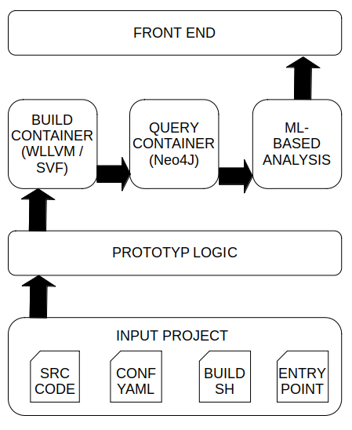

# Developer Documentation

This document should provide the necessary steps and information to a developer who is interested in changing or expanding the ml-sast prototype. To obtain detailed information about the ml-sast prototype as well as the topic of static software analysis in general, please have a look at the following [study](https://www.bsi.bund.de/DE/Service-Navi/Publikationen/Studien/ML-SAST/ml-sast_node.html).

## Required Development Tools

- *nix operating system
- git
- python3
- pip
- docker
- IDE of your choice

## Architecture

The ml-sast prototype was developed with the idea in mind that it should be easily adaptable as well as expandable. The prototype follows a pipeline structure, which is composed of different phases, see the figure below. Each phase inherits from a base class and must implement one single method, which serves as the entrypoint. The different phases can be configured that they require a certain phase to be executed prior to their execution.

The main interface of the different phases is designed around a simple project directory. This project directory contains all the needed information to perform an analysis, namely these are the following:
1. the source code a user wants to analyze in a subdirectory
2. a YAML configuration file, which defines the pipeline phases as
well as the phase-specific parameters
3. a C / C++ entrypoint file which calls all APIs defined by the
source code
4. a BASH script which defines how to compile the source code, calling
all the APIs that are defined in it, with the help of the entrypoint
file.

## Customization

The analysis steps implemented in the prototype can be used as a blueprint for your custom analysis pipeline. The analysis on the example project, provided with the prototype, is based on three phases. In the first phase `svf` the software is build and the Interprocedural Control Flow Graph is generated.

In the second step of the analysis `neo4j` this graph is loaded into a graph database, namely Neo4j, and paths are extracted based on a custom query. The query used to obtain the paths can be modified in the `config.yaml`.

In the third step `distance` the extracted paths are classified as being vulnerable by computing the distance of these paths, to the paths of known vulnerabilities. These known vulnerabilities are provided with the prototype and have been extracted from the Interprocedural Control Flow Graph of the [Juliet Test Suite for C and C++](https://samate.nist.gov/SARD/test-suites/112).

In the current configuration centroids of the paths from the Juliet Test Suite are calculated and a feasible threshold for each defect-class is computed. To determine if an unknown path is vulnerable its distance to the centroids is calculated. If the distance to a centroid subceeds the defined threshold the path is reported as being potentially vulnerable and marked with the respective defect-class.

The above described distance phase can be easily adapted. One could for example use a different clustering algorithm to find the centroids. Currently, the `kmeans` algorithm is used to initialize centroids on paths for the various defect classes of the Juliet test suite. This would be a relatively minor and simple adaptation as a developer would only need to add another clustering algorithm in the method `_get_centroids` of the distance step.

Instead of using a distance based measure to find potential vulnerable path one could also use a different procedure for detection of those. One could for example train a neural network on the paths from the Juliet test suite to distinguish vulnerable and benign paths. This model could then be used to predict if unknown paths are either benign or vulnerable. For this a developer should keep the first two analysis steps, namely `svf` and `neo4j` to construct the Interprocedural Control Flow Graph and extract paths between function entry and exit nodes, using the custom query defined in `config.yaml` under the `neo4j` step. A developer would then need to implement a new analysis step, for example named `neural-network`. First the extracted paths from the model (icfg path from the Juliet test suite and stored in `models/juliet.zip` ), using the method `_load_paths_from_model` from the `distance` step, should be loaded. The paths can be embedded by calling the method `_embed_paths`. Afterwards the trained model could be evaluated on paths extracted from a software project under analysis to classify them as being benign or vulnerable.

Further customizations of the prototype would be possible in the following places. One could for example extend the path embedding techniques. One could change the node property that should be embedded by simply changing the relevant parameter `node_property` in the `config.yaml` file. A more profound adjustment for the path embedding would be to use a more sophisticated path embedding technique. For this a developer would need to extend the `_embed_paths` method.

## How to train the prototype with new data

There are several ways to incorporate new paths into the prototype that can then be used to classify unknown paths. On the one hand you could analyze a software project with the steps outlined in the `example` project. The report which is generated could then be visualized with the help of the ml-sast front-end. If the prototype detected vulnerable paths, you can add the corresponding path to the model and thus refine and improve the model.

On the other hand, one could also use known vulnerable and benign examples to improve the paths used to create the centroids. First one would have to extract the paths from these examples with the `svf` and `neo4j` phases. Afterwards they should be labelled as either benign or vulnerable. One could then use these paths on top of the paths that come with the prototype to initialize centroids in the `distance` phase.
